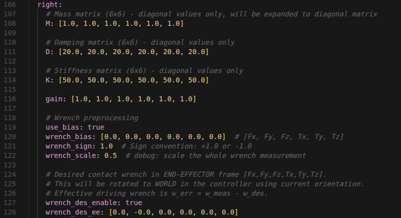

# WA型号\-MPC使用接口文档\-外部 副本

# 一、文档说明

本文档适用于 **轮臂 WA1 ****/ WA2 ****型号下 MPC 运控功能 **使用

# 二\. Step 4: MPC 与 SDK 切换示例

MPC 运行时会以 200Hz 调用 servoJ，此时 **不允许调用 SDK 相关接口**，否则易出现不安全行为或进入保护

正确切换方式：以开启示教为例

```Bash
## Step 1: stop mpc mode
rosservice call /wa/wa_hardware_interface/mpc_mode_setting "data: false"
## Step 2: use SDK service
rosservice call /zj_humanoid/upperlimb/teach_mode enter "xxxxx"
## Step 3: start mpc mode
rosservice call /wa/wa_hardware_interface/mpc_mode_setting "data: true"
```

开启 mpc 控制节点后，应当 用 mode setting 开启和关闭 mpc控制模式

尽量避免 结束 mpc 控制进程 

mpc相关话题在mpc关闭模式时仍然提供 \-\> 包括末端位姿、自避障距离等等


# 三、调用手册

## 任务空间多路点运动 

### 1\.1 服务调用名：

```Bash
wa/points_seq_tracking                         // 任务空间点序列跟踪 -> for service
```

### 1\.2 接口文件 \- srv：

```YAML
# PointsSeqTracking.srv
# Request 
geometry_msgs/PoseArray left_poses      # 左手目标序列（每个Pose包含位置和姿态）
geometry_msgs/PoseArray right_poses     # 右手目标序列
float64[] time_points                   # 每段时长
float64 max_period                      # 最大等待周期
float64 weight                          # 每段权重
string type                             # "quintic", "spline"

---
# Response
bool success
string message
```

注意，**mpc坐标系与SDK坐标系存在偏差**，下发 pose 通常有三种方式：

方式 1: 通过 /DualArmMobile/currentEEPose/FrameL /DualArmMobile/currentEEPose/FrameR 获取

方式 2: 直接通过 tf 订阅 /root 和 期望坐标系 获取

方式 3: 获取 SDK 坐标系下位姿后，保持xy不变，**z轴增加0\.25m \(wa1\) / 0\.35m \(wa2\)**，保持姿态不变

### 1\.3 服务说明：

|type|特点|首尾点|
|---|---|---|
|quintic|慢起慢停|速度、加速度为0|
|spline|连续动作|速度为0，加速度不为0|

|weight||特点|
|---|---|---|
|大（\\geq 1\.5）||跟踪精度高，但易受扰动影响而震荡|
|小（\\leq 1\.0）||跟踪精度相较低|

### 1\.4 使用示例：

```C++
void test_case_ee_seq(ros::ServiceClient& client, std::string type){
  mpc_target::PointsSeqTracking srv;

  std::vector<Eigen::Vector3d> positions_l_points = {
    Eigen::Vector3d(0.65, 0.2, 0.95),
    Eigen::Vector3d(0.65, 0.2, 1.05),
    Eigen::Vector3d(0.65, 0.2, 1.15),
  };
  std::vector<Eigen::Quaterniond> orientations_l_points = {
    Eigen::Quaterniond(0.707, 0, -0.707, 0),
    Eigen::Quaterniond(0.707, 0, -0.707, 0),
    Eigen::Quaterniond(0.707, 0, -0.707, 0),
  };
  
  std::vector<Eigen::Vector3d> positions_r_points = {
    Eigen::Vector3d(0.65, -0.2, 0.95),
    Eigen::Vector3d(0.65, -0.2, 1.05),
    Eigen::Vector3d(0.65, -0.2, 1.15),
  };
  std::vector<Eigen::Quaterniond> orientations_r_points = {
    Eigen::Quaterniond(0.707, 0, -0.707, 0),
    Eigen::Quaterniond(0.707, 0, -0.707, 0),
    Eigen::Quaterniond(0.707, 0, -0.707, 0),
  };

  std::vector<double> T = {3.0, 3.0, 2.0};
  double max_period = 1;
  double weight = 1.0;

  geometry_msgs::PoseArray poses_arr_l, poses_arr_r;
  VectorEigenToGeometryPoseArray(positions_l_points, orientations_l_points, poses_arr_l);
  VectorEigenToGeometryPoseArray(positions_r_points, orientations_r_points, poses_arr_r);

  srv.request.left_poses = poses_arr_l;
  srv.request.right_poses = poses_arr_r;
  srv.request.time_points = T;
  srv.request.max_period = max_period;
  srv.request.weight = weight;
  srv.request.type = type;

  std::cout << "test_case_ee_seq ------- " << std::endl;
  client.call(srv);
  std::cout << "test_case_ee_seq result ------- end -- " << srv.response.success << std::endl;
}

int main(int argc, char** argv)
{
    ros::init(argc, argv, "test_point_tracking_client");
    ros::NodeHandle nh;

    ros::AsyncSpinner spinner(4);  // 只在main里创建和启动
    spinner.start();

    ros::ServiceClient client_ee = nh.serviceClient<mpc_target::PointsSeqTracking>("/wa1/points_seq_tracking");

    ROS_INFO("Waiting for /wa1/points_seq_tracking service...");
    if (!client_ee.waitForExistence(ros::Duration(10.0)) || !client_joints.waitForExistence(ros::Duration(10.0))) {
        ROS_ERROR("/wa1/points_seq_tracking service not available after 10 seconds, exiting.");
        return 1; // 或者其他错误处理
    }
    ROS_INFO("/wa1/points_seq_tracking service is now available.");

    test_case_init(client_ee);
    ros::Duration(2.0).sleep();

    test_case_ee_seq(client_ee, "quintic");
    ros::Duration(2.0).sleep();

    test_case_init(client_ee);
    ros::Duration(2.0).sleep();
    
    test_case_ee_seq(client_ee, "spline");
    ros::Duration(2.0).sleep();
    return 0;
}
```

## 

## 关节空间多路点运动

### 2\.1 服务调用名：

```Bash
wa/joints_seq_tracking                         // 关节空间点序列跟踪
```

### 2\.2 接口文件 \- srv：

```YAML
# JointsSeqTracking.srv
# Request
float64[] states                        # 每个点期望的关节角度（展平） -> 必须指定正确的关节角度个数
int8 joint_num                          # 关节角度个数 -> 20 目前必须为制定20维度
float64[] time_points                   # 每个点的绝对时间
float64 max_period                      # 最大等待周期
float64 weight                          # 每段权重

---
# Response
bool success
string message

# for wa1
# 0  - x_dir_joint
# 1  - y_dir_joint
# 2  - z_dir_joint
# 3  - Lifting_Z
# 4  - Waist_Z
# 5  - Waist_Y
# 6  - Shoulder_Y_L
# 7  - Shoulder_X_L
# 8  - Shoulder_Z_L
# 9  - Elbow_L
# 10  - Wrist_Z_L
# 11  - Wrist_Y_L
# 12  - Wrist_X_L
# 13  - Shoulder_Y_R
# 14  - Shoulder_X_R
# 15  - Shoulder_Z_R
# 16  - Elbow_R
# 17  - Wrist_Z_R
# 18  - Wrist_Y_R
# 19  - Wrist_X_R

# for wa2
# 0  - x_dir_joint
# 1  - y_dir_joint
# 2  - z_dir_joint
# 3  - Pitch_Y_B
# 4  - Pitch_Y_M
# 5  - Waist_Z
# 6  - Waist_Y
# 7  - Shoulder_Z_L
# 8  - Shoulder_Y_L
# 9  - Shoulder_X_L
# 10  - Elbow_Z_L
# 11  - Elbow_Y_L
# 12  - Wrist_Z_L
# 13  - Wrist_Y_L
# 14  - Wrist_X_L
# 15  - Shoulder_Z_R
# 16  - Shoulder_Y_R
# 17  - Shoulder_X_R
# 18  - Elbow_Z_R
# 19  - Elbow_Y_R
# 20  - Wrist_Z_R
# 21  - Wrist_Y_R
# 22  - Wrist_X_R
```

该关节顺序与 SDK 存在出入 \-\> 从底到上

如果期望复现示教点位，可以采用下述简单步骤，步骤如下：

Step 1: 关闭 mpc 模式 rosservice call /wa/wa\_hardware\_interface/mpc\_mode\_setting "data: false"

Step 2: 进入SDK示教模式

Step 3: rostopic echo /DualArmMobile/currenState

其中 currentState\.StateTrajectory 填入srv接口即可

### 2\.3 服务说明：

|weight||特点|
|---|---|---|
|大（\\geq 200\.0）||适合要求腰部快速跟踪的场景|
|通常（\\leq 100\.0）||适合腰部慢速、手臂快速跟踪的场景|

### 2\.4 使用示例：

```C++
std::vector<double> current_joint_positions(20);
std::mutex current_joint_positions_mutex;

void jointStateCallback(const ocs2_msgs::mpc_target_trajectories::ConstPtr& msg)
{
    std::lock_guard<std::mutex> lock(current_joint_positions_mutex);
    const auto& value = msg->stateTrajectory[0].value;
    // std::cout << "jointStateCallback ------- " << std::endl;
    current_joint_positions.resize(value.size());
    for (size_t i = 0; i < value.size(); ++i) 
        current_joint_positions[i] = static_cast<double>(value[i]);
}

void test_case_joints_seq(ros::ServiceClient& client){
  std::vector<double> joint_positions;
  {
    std::lock_guard<std::mutex> lock(current_joint_positions_mutex);
    joint_positions = current_joint_positions;
  }
  std::vector<double> target_joint_states;
  for(int i = 0; i < joint_positions.size(); i++){
    target_joint_states.push_back(joint_positions[i]);
  }
  target_joint_states[4] = 1.2;
  target_joint_states[5] = 0.3;    // 4: Waist_Z 5: Waist_Y
  target_joint_states[16] = -0.5;

  for(int i = 0; i < joint_positions.size(); i++){
    target_joint_states.push_back(joint_positions[i]);
  }
  target_joint_states[24] = 0;
  target_joint_states[25] = 0;    // Waist_Z
  target_joint_states[36] = -1.4;
  
  mpc_target::JointsSeqTracking srv;
  std::vector<double> T = {5.0, 5.0};
  double max_period = 2;
  double weight = 10.0;

  srv.request.states = target_joint_states;
  srv.request.time_points = T;
  srv.request.max_period = max_period;
  srv.request.weight = weight;
  srv.request.joint_num = 20;

  std::cout << "test_case_joints_seq ------- " << std::endl;
  client.call(srv);
  std::cout << "test_case_joints_seq result ------- end -- " << srv.response.success << std::endl;
}

int main(int argc, char** argv)
{
    ros::init(argc, argv, "test_point_tracking_client");
    ros::NodeHandle nh;

    ros::AsyncSpinner spinner(4);  // 只在main里创建和启动
    spinner.start();

    ros::ServiceClient client_joints = nh.serviceClient<mpc_target::JointsSeqTracking>("/wa1/joints_seq_tracking");

    test_case_joints_seq(client_joints);
    ros::Duration(2.0).sleep();
    return 0;
}
```


## 关节空间运动（仅Neck关节）

Neck Joint 并不参与 tcp 解算，但使用时 **支持单独非阻塞控制**

### 3\.1 服务调用名：

```Bash
/wa/wa_hardware_interface/neck_movej                      // neck 关节点跟踪
```

### 3\.2 接口文件 \- srv：

```YAML
float64[] neck_joint     # [neck z neck y]
int32 t                  # time
---
bool success
string message
```

### 3\.3 Neck Joint 补丁服务 \- 接口文件 \- srv：

|params||含义|
|---|---|---|
|neck\_joint||期望的 neck 关节角度|
|t||期望到达的时间|


## 任务空间/关节空间联合多路点运动

### 4\.1 服务调用名：

```Bash
wa/points_seq_tracking_with_joints             // 任务空间 + 关节空间点序列跟踪
```

### 4\.2 接口文件 \- srv：

```YAML
# PointsSeqTrackingWithJoints.srv
# Request
geometry_msgs/PoseArray left_poses      # 左手目标序列（每个Pose包含位置和姿态）
geometry_msgs/PoseArray right_poses     # 右手目标序列
float64[] time_points                   # 每段时长
float64[] states                        *# 每个点期望的关节角度（展平） -> 必须指定正确的关节角度个数*
int8 joint_num                           *# 关节角度个数 -> 0 表示不指定*
float64 max_period                      # 最大等待周期
float64 weight                          # 每段权重
string type                             # "quintic", "spline"

---
# Response
bool success
string message
```

### 4\.3 服务说明：

|对比||相同|不同|
|---|---|---|---|
|任务空间点序列跟踪||都用于末端位姿跟踪|对关节角度没有要求|
|任务空间 \+ 关节空间 联合点序列跟踪|||可设置关节角度 \-\> 例如要求不弯腰/强制要求弯腰<br>（关节角度仅用于启发，不必精确对应IK）|

### 4\.4 使用示例：

```C++
std::vector<double> current_joint_positions(20);
std::mutex current_joint_positions_mutex;

void jointStateCallback(const ocs2_msgs::mpc_target_trajectories::ConstPtr& msg)
{
    std::lock_guard<std::mutex> lock(current_joint_positions_mutex);
    const auto& value = msg->stateTrajectory[0].value;
    // std::cout << "jointStateCallback ------- " << std::endl;
    current_joint_positions.resize(value.size());
    for (size_t i = 0; i < value.size(); ++i) 
        current_joint_positions[i] = static_cast<double>(value[i]);
}

void test_case_ee_with_joints_seq(ros::ServiceClient& client, std::string type){
  mpc_target::PointsSeqTrackingWithJoints srv;

  std::vector<Eigen::Vector3d> positions_l_points = {
    Eigen::Vector3d(0.65, 0.2, 0.95),
    Eigen::Vector3d(0.65, 0.2, 1.05),
    Eigen::Vector3d(0.65, 0.2, 1.15),
  };
  std::vector<Eigen::Quaterniond> orientations_l_points = {
    Eigen::Quaterniond(0.707, 0, -0.707, 0),
    Eigen::Quaterniond(0.707, 0, -0.707, 0),
    Eigen::Quaterniond(0.707, 0, -0.707, 0),
  };
  
  std::vector<Eigen::Vector3d> positions_r_points = {
    Eigen::Vector3d(0.65, -0.2, 0.95),
    Eigen::Vector3d(0.65, -0.2, 1.05),
    Eigen::Vector3d(0.65, -0.2, 1.15),
  };
  std::vector<Eigen::Quaterniond> orientations_r_points = {
    Eigen::Quaterniond(0.707, 0, -0.707, 0),
    Eigen::Quaterniond(0.707, 0, -0.707, 0),
    Eigen::Quaterniond(0.707, 0, -0.707, 0),
  };

  std::vector<double> T = {3.0, 3.0, 2.0};
  double max_period = 1;
  double weight = 1.0;

  geometry_msgs::PoseArray poses_arr_l, poses_arr_r;
  VectorEigenToGeometryPoseArray(positions_l_points, orientations_l_points, poses_arr_l);
  VectorEigenToGeometryPoseArray(positions_r_points, orientations_r_points, poses_arr_r);

  srv.request.left_poses = poses_arr_l;
  srv.request.right_poses = poses_arr_r;
  srv.request.time_points = T;
  srv.request.max_period = max_period;
  srv.request.weight = weight;
  srv.request.type = type;

  std::vector<double> joint_positions;
  {
    std::lock_guard<std::mutex> lock(current_joint_positions_mutex);
    joint_positions = current_joint_positions;
  }
  std::vector<double> target_joint_states;
  for(int i = 0; i < joint_positions.size(); i++){
    target_joint_states.push_back(joint_positions[i]);
  }
  target_joint_states[5] = -0.3;

  for(int i = 0; i < joint_positions.size(); i++){
    target_joint_states.push_back(joint_positions[i]);
  }
  target_joint_states[24] = 0.1;
  target_joint_states[25] = -0.3;

  for(int i = 0; i < joint_positions.size(); i++){
    target_joint_states.push_back(joint_positions[i]);
  }

  srv.request.states = target_joint_states;
  srv.request.joint_num = 20;

  std::cout << "test_case_ee_with_joints_seq ------- " << std::endl;
  client.call(srv);
  std::cout << "test_case_ee_with_joints_seq result ------- end -- " << srv.response.success << std::endl;
}

int main(int argc, char** argv)
{
    ros::init(argc, argv, "test_point_tracking_client");
    ros::NodeHandle nh;

    ros::AsyncSpinner spinner(4);  // 只在main里创建和启动
    spinner.start();

    ros::ServiceClient client_ee_with_joints = nh.serviceClient<mpc_target::PointsSeqTrackingWithJoints>("/wa1/points_seq_tracking_with_joints");
    ros::Subscriber joint_state_sub = nh.subscribe("/DualArmMobile/currenState", 1, jointStateCallback);

    test_case_ee_with_joints_seq(client_ee_with_joints, "spline");
    ros::Duration(2.0).sleep();
    
    return 0;
}
```

## 双臂协同运动

### 5\.1 服务调用名：

```Bash
wa/points_seq_collaborative_tracking             # 双臂协同点序列跟踪
```

### 5\.2 接口文件 \- srv

```YAML
# PointsSeqCollaborativeTracking.srv
# Request
geometry_msgs/PoseArray major_arm_poses # 主臂目标序列（每个Pose包含位置和姿态）
float64[] time_points                   # 每个点的绝对时间
float64 max_period                      # 最大等待周期
float64 track_weight                    # 每段跟踪权重
float64 collaborate_weight              # 每段协同权重
string way_type                             # "quintic", "spline"
string major_arm                        # "left", "right"

---
# Response
bool success
string message
```

### 5\.3 服务说明：

适用于双臂搬运等需要严格协同的场景，调用后，双臂将维持当前相对位姿不变，主臂运动至给定任务空间点位

|参数|含义|
|---|---|
|major\_arm\_poses|主臂期望位姿 \-\> 对于协同，只能指定左臂或右臂，另一只臂将跟踪运动|
|track\_weight|通常 1\.0 \-\> 值越大，则跟踪越精准，但不利于协同（容易产生应力）|
|collaborate\_weight|通常 1\.0 \-\> 暂时不开放|
|major\_arm|指定主臂 \-\> 需要对应 major\_arm\_poses|

### 5\.4 使用示例：

```C++
void test_collaborate(){
    mpc_target::PointsSeqCollaborativeTracking srv;
    {
      std::lock_guard<std::mutex> lock(observation_mutex_);
      if(feedback->marker_name.substr(5) == "TCP_L"){
        srv.request.major_arm_poses.poses.push_back(left_hand_pose_);
        srv.request.major_arm = "left";
      } 
      else if(feedback->marker_name.substr(5) == "TCP_R"){
        srv.request.major_arm_poses.poses.push_back(right_hand_pose_);
        srv.request.major_arm = "right";
      }
    }
    srv.request.time_points.push_back(5.0);  
    srv.request.max_period = 5.0;           
    srv.request.track_weight = 1.0;          
    srv.request.collaborate_weight = 1.0;
    srv.request.way_type = "spline";
    
    *// 调用服务*
    if (collaborative_service_client_.call(srv)) {
      if (srv.response.success) {
        ROS_INFO("Collaborative target published");
      } else {
        ROS_WARN("Collaborative target published failed");
      }
    }
}
```

## 导纳控制 \+ 任务空间多路点运动

### 6\.1 服务调用名：

```Bash
wa/admittance_mode_setting                 # 导纳模式开启
wa/points_seq_tracking_with_admittance    # 基于 导纳模式 的任务空间路点跟踪
```

### 6\.2 接口文件\-srv：

对于 wa/admittance\_mode\_setting \-\> std::SetBool 对应 std\_srv

对于 wa/points\_seq\_tracking\_with\_admittance \-\> 则同 PointsSeqTracking\.srv

```YAML
# PointsSeqTracking.srv
# Request
geometry_msgs/PoseArray left_poses      # 左手目标序列（每个Pose包含位置和姿态）
geometry_msgs/PoseArray right_poses     # 右手目标序列
float64[] time_points                   # 每段时长
float64 max_period                      # 最大等待周期
float64 weight                          # 每段权重
string type                             # "quintic", "spline"

---
# Response
bool success
string message
```

### 6\.3 服务说明

适用于需要末端柔顺控制/期望力接触的场景

|type|特点|首尾点|
|---|---|---|
|quintic|慢起慢停|速度、加速度为0|
|spline|连续动作|速度为0，加速度不为0|

|weight||特点|
|---|---|---|
|通常 1\.0||Weight 越大，则跟踪精度越高，但更容易受力扰动|

### 6\.4 使用示例

```C++
admittance_mode_setting_service_client_ = nodeHandle.serviceClient<std_srvs::SetBool>("/wa/admittance_mode_setting");
points_seq_tracking_client_ = nodeHandle.serviceClient<mpc_target::PointsSeqTracking>("/wa/points_seq_tracking");
admittance_points_seq_tracking_client_ = nodeHandle.serviceClient<mpc_target::PointsSeqTracking>("/wa/points_seq_tracking_with_admittance");

std_srvs::SetBool srv;
srv.request.data = true;

if (admittance_mode_setting_service_client_.call(srv)) {
  ROS_INFO("Admittance mode setting service call successful");
} 
else {
  ROS_WARN("Admittance mode setting service call failed");
}

mpc_target::PointsSeqTracking srv;
{
  std::lock_guard<std::mutex> lock(observation_mutex_);
  srv.request.left_poses.poses.push_back(left_hand_pose_);
  srv.request.right_poses.poses.push_back(right_hand_pose_);
}

srv.request.time_points.push_back(3.0);
srv.request.max_period = 3.0;
srv.request.weight = 1.0;
srv.request.type = "quintic";

if(admittance_mode_on_){
  if(admittance_points_seq_tracking_client_.call(srv)){
    ROS_INFO("Admittance target sending service call successful");
  } 
  else{
    ROS_WARN("Admittance target sending service call failed");
  }
}
else{
  if(points_seq_tracking_client_.call(srv)){
    ROS_INFO("Points sequence tracking service call successful");
  } 
  else{
    ROS_WARN("Points sequence tracking service call failed");
  }
}
```

### 6\.5 使用注意事项（重要）

1\. 启动MPC前需开启力传感器，并检查 `/wrist_force_control/left_arm_compensated_force`

2\. MPC开启导纳模式后，可用手轻微触碰手指，观测末端“软”/“硬”情况 

3\. 步骤示例：

调用接口stream：开启MPC模式 \-\> 开启导纳模式 \-\> 调用导纳多路点运动

切回SDKstream：关闭导纳模式 \-\> 关闭MPC模式 \-\> 调用SDK接口

### 6\.6 config配置

对于不同应用场景的期望力追求，当前接口允许使用者自行配置

路径：`/install/share/mpc_target/config/admittance/default_admittance.yaml`



其中 wrench des ee \-\> 即对应6维期望力（末端TCP坐标系）

通常而言，如果仅仅是希望接触力不要过大，全为 0 即可

## 单臂关节空间 \+ 单臂任务空间 混合运动

### 7\.1 服务调用名：

```Bash
wa/hybrid_points_seq_tracking    # 混合运动
```

### 7\.2 接口文件 \- srv

```YAML
# HybridPointsSeqTracking.srv
# Request
geometry_msgs/PoseArray arm_poses       # tcp 臂目标序列（每个Pose包含位置和姿态）
float64[] arm_states                    # 每个点期望的关节角度（展平） -> 必须指定正确的关节角度个数 -> empty 则默认不动
int8 joint_num                          # arm 关节角度个数 -> wa1 7, wa2 8
float64[] time_points                   # 每个点的绝对时间（或每段时长，需约定）
float64 max_period                      # 最大等待周期
float64 track_weight                    # 每段跟踪权重
string way_type                         # "quintic", "spline"
string major_arm                        # "left", "right"

---
# Response
bool success
string message
```

### 7\.3 服务说明

适用于单臂关节空间控制 \+ 单臂任务空间控制的场景

|params|说明||
|---|---|---|
|arm\_states|joint num \* n|n个时间点的arm关节角度|
||empty|默认保持当前arm关节角度|
|weight|通常 1\.0|weight 越大，精度越高，但更易受外力扰动|

### 7\.4 使用示例

```C++
ros::ServiceClient client_hybrid_points_seq = nh.serviceClient<mpc_target::HybridPointsSeqTracking>("/wa/hybrid_points_seq_tracking");

void test_case_hybrid_points_seq(ros::ServiceClient& *client*){
  mpc_target::HybridPointsSeqTracking srv;
  
  std::vector<Eigen::Vector3d> positions_l_points = {
    Eigen::Vector3d(0.55, 0.2, 0.95),
    Eigen::Vector3d(0.55, 0.2, 1.05),
    Eigen::Vector3d(0.55, 0.2, 1.15),
  };
  std::vector<Eigen::Quaterniond> orientations_l_points = {
    Eigen::Quaterniond(0.707, 0, -0.707, 0),
    Eigen::Quaterniond(0.707, 0, -0.707, 0),
    Eigen::Quaterniond(0.707, 0, -0.707, 0),
  };

  VectorEigenToGeometryPoseArray(positions_l_points, orientations_l_points, srv.request.arm_poses);

*  // arm_states left empty → right arm keeps current joint state*
  srv.request.arm_states = {
    0, 0, -0.6, 0, 0, 0, 0, 0,
    0, 0, -0.6, 0, 0, 0, 0, 0,
    0, 0, -0.6, 0, 0, 0, 0, 0,
  };
*  // srv.request.arm_states.clear();*
  srv.request.joint_num = 8;*  // wa1*

  srv.request.time_points = {3.0, 3.0, 3.0};
  srv.request.max_period  = 2.0;
  srv.request.track_weight = 1.0;
  srv.request.way_type = "quintic";
  srv.request.major_arm = "left";

  std::cout << "test_case_hybrid_points_seq ------- " << std::endl;
  if (client.call(srv))
    std::cout << "result: success=" << (int)srv.response.success << std::endl;
  else
    std::cout << "result: failed to call service" << std::endl;
}
```


